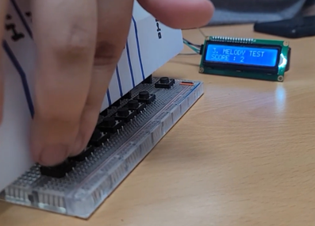

# 스피커 및 센서를 활용한 ‘음악아 친해지자' 기기

## 프로젝트 개요
- 독거 노인의 증가로 노인 우울증 비중이 크게 증가
- 해당 기기에 참여하여 노인의 성취감을 높여 우울증 개선 목표

## 응용 시스템 제작

- 다음과 같이 입력, 메인 , 출력 파이를 구성

## 기술 분석

### PWM을 이용한 소리 출력
- PWM를 이용해 주파수 및 음향 크기 조절- 스피커 구현 스피커를 통해 입력 받은 신호에 따라 알맞은 소리를 출력하도록 하거나 미리 구성되어 있는 음악을 출력

### IC2 통신을 이용하여 LDC 구현
-I2C 통신을 통한 LCD 구현 LCD를 통해 게임 진행 결과, 메뉴 정보, 리듬 게임의 박자에 맞는 블록 등을 사용자들에게 시각적으로 표현

### 게임 진행
- 버튼을 통해 어떠한 메뉴를 진행할지 선택하고 메뉴가 선택되었다면 그에 맞는 디바이스들을 활성화하여 작동하여 실행.  기능 실행 중간에 나가고  싶다면 홈 버튼을 통해 다시 메뉴로 
돌아감. 각각의 메뉴가 끝나고 점수  출력이 필요하다면 LCD를 통해 출력

### 소켓 통신
- 입력 Pi -> 메인Pi  메인 Pi -> 출력 Pi 서로 다른 세가지 라즈베리파이간의 정보 전달을 하기 위한 창구 역할로 메뉴 번호, 주파수, 게임의 점수 등을 수송신한다. 

### 스레딩
- LCD와 스피커 수신과 송신 스레딩을 통해 프로세스를 여러 실행 단위로 나누어 각각의 기능들에 대한 관리의 중복성을 최소화 시키고 기능을 지닌 함수들의 병행  실행

### 기능

0. 메뉴 선택
필요장치: 버튼 4개 LCD 1개
	(각 버튼을 누르면 해당 서비스에 해당하는 메뉴로 넘어간다.)
	LCD를 통해 메뉴를 출력한다.
1.  1번 버튼을 누르면, 피아노 메뉴로 넘어간다.
2.  2번 버튼을 누르면, 녹음 실행 메뉴로 넘어간다.
3.  3번 버튼을 누르면, 절대 음감 테스트 메뉴로 넘어간다.
4.  4번 버튼을 누르면, 저장된 첫 번째 음악 출력 메뉴로 넘어간다.
5.  5번 버튼을 누르면,  저장된 두 번째 음악 출력 메뉴로 넘어간다.

### 역할 분담
ME - 전체적인 알고리즘 구현, 입력PI 코드 작성, 입력 PI와 입력 PI에 사용되는 IO 장치 연결
A - 메인PI-출력 PI 코드 작성, 출력 PI에 사용되는 IO 장치 연결
B - 최종 코드 점검, 메인PI-출력PI 코드 작성, 출력 PI에 사용되는 IO 장치 연결
